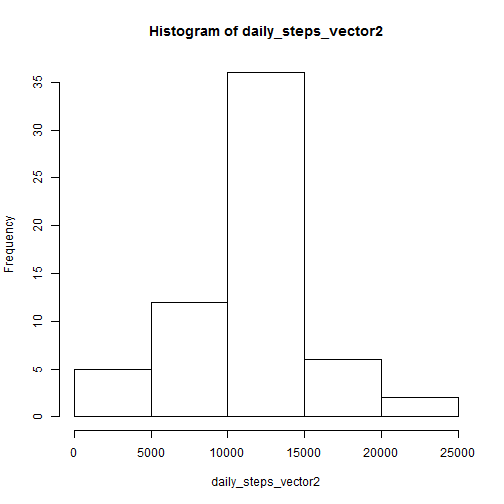

This R Markdown was created to describe the steps taken to accomplish the peer assigmment 1, part of Reproducible Research module of Data Science course from Johns Hopkins Bloomberg School of Public Health.

##Data##
The personal activity recorded using a monitoring device is used as the base input data for this assignment.

##Loading required packages##


##1. Loading the data##

```r
acty <- read.csv("activity.csv")
```

```
## Warning in file(file, "rt"): cannot open file 'activity.csv': No such file
## or directory
```

```
## Error in file(file, "rt"): cannot open the connection
```

##2. Mean Total Number of Steps taken per day##

###a. Filter out incomplete rows###

```r
valid_acty <- sqldf("select * from acty where steps <> 'NA'")
```

###b. Total Number of steps taken per day###

```r
daily_steps <- sqldf("select date 'Date', sum(steps) 'steps_per_day' from valid_acty group by date")
daily_steps
```

```
##          Date steps_per_day
## 1  2012-10-01      10766.19
## 2  2012-10-02        126.00
## 3  2012-10-03      11352.00
## 4  2012-10-04      12116.00
## 5  2012-10-05      13294.00
## 6  2012-10-06      15420.00
## 7  2012-10-07      11015.00
## 8  2012-10-08      10766.19
## 9  2012-10-09      12811.00
## 10 2012-10-10       9900.00
## 11 2012-10-11      10304.00
## 12 2012-10-12      17382.00
## 13 2012-10-13      12426.00
## 14 2012-10-14      15098.00
## 15 2012-10-15      10139.00
## 16 2012-10-16      15084.00
## 17 2012-10-17      13452.00
## 18 2012-10-18      10056.00
## 19 2012-10-19      11829.00
## 20 2012-10-20      10395.00
## 21 2012-10-21       8821.00
## 22 2012-10-22      13460.00
## 23 2012-10-23       8918.00
## 24 2012-10-24       8355.00
## 25 2012-10-25       2492.00
## 26 2012-10-26       6778.00
## 27 2012-10-27      10119.00
## 28 2012-10-28      11458.00
## 29 2012-10-29       5018.00
## 30 2012-10-30       9819.00
## 31 2012-10-31      15414.00
## 32 2012-11-01      10766.19
## 33 2012-11-02      10600.00
## 34 2012-11-03      10571.00
## 35 2012-11-04      10766.19
## 36 2012-11-05      10439.00
## 37 2012-11-06       8334.00
## 38 2012-11-07      12883.00
## 39 2012-11-08       3219.00
## 40 2012-11-09      10766.19
## 41 2012-11-10      10766.19
## 42 2012-11-11      12608.00
## 43 2012-11-12      10765.00
## 44 2012-11-13       7336.00
## 45 2012-11-14      10766.19
## 46 2012-11-15         41.00
## 47 2012-11-16       5441.00
## 48 2012-11-17      14339.00
## 49 2012-11-18      15110.00
## 50 2012-11-19       8841.00
## 51 2012-11-20       4472.00
## 52 2012-11-21      12787.00
## 53 2012-11-22      20427.00
## 54 2012-11-23      21194.00
## 55 2012-11-24      14478.00
## 56 2012-11-25      11834.00
## 57 2012-11-26      11162.00
## 58 2012-11-27      13646.00
## 59 2012-11-28      10183.00
## 60 2012-11-29       7047.00
## 61 2012-11-30      10766.19
```

###c. Histogram of total steps per day###

```r
daily_steps_vector <- as.vector(daily_steps$`steps_per_day`)
hist(daily_steps_vector)
```

 

###d. Mean and Median of total steps per day###

```
## [1] "Mean of total steps per day: 10766.1886792453"
```

```
## [1] "Median of total steps per day: 10766.1886792453"
```

##3. Average daily activity pattern##
###a. Time series plot of the 5-minute interval and average numbmer of steps taken, averaged across all days###
 

###b. The 5-minute interval with maximum number of steps###

```
##   interval
## 1      835
```

##4. Imputing Missing values##
###a. Number of missing values

```r
print(count(filter(acty, is.na(steps))))
```

```
## Source: local data frame [1 x 1]
## 
##   n
## 1 0
```

###b. Filling in missing data###

```r
for (timeElem in unique(acty$interval)) {
  avg_steps <- five_min_avg[five_min_avg$interval == timeElem, 1]
  acty[is.na(acty$steps) & acty$interval == timeElem, 1] <- avg_steps
}
head(acty)
```

```
##       steps       date interval dayType
## 1 1.7169811 2012-10-01        0 weekday
## 2 0.3396226 2012-10-01        5 weekday
## 3 0.1320755 2012-10-01       10 weekday
## 4 0.1509434 2012-10-01       15 weekday
## 5 0.0754717 2012-10-01       20 weekday
## 6 2.0943396 2012-10-01       25 weekday
```

###c. Save the activity with imputed data###

```r
write.csv(acty, file = "imputed_activity.csv")
```

###d. Histogram of total steps with imputed data###

```r
daily_steps2 <- sqldf("select date 'Date', sum(steps) 'steps_per_day' from acty group by date")
daily_steps_vector2 <- as.vector(daily_steps2$`steps_per_day`)
hist(daily_steps_vector2)
```

 

###e. Mean and Median of total steps per day with imputed data###

```r
print(paste("Mean of total steps per day:", mean(daily_steps_vector2)))
```

```
## [1] "Mean of total steps per day: 10766.1886792453"
```

```r
print(paste("Median of total steps per day:", median(daily_steps_vector2)))
```

```
## [1] "Median of total steps per day: 10766.1886792453"
```

###f. Impact of imputing missing data###

```r
print(paste("Step count is now available for",count(daily_steps2),"as against the original", count(daily_steps),"days"))
```

```
## [1] "Step count is now available for 61 as against the original 61 days"
```

##5. Difference in activity pattern between Weekdays and Weekends##
###a. Introducing new factor variable "dayType" to hold "weekday" or "weekend" based on the "date" value###

```r
acty <- mutate(acty, dayType = ifelse((as.POSIXlt(acty$date)$wday == 0 | as.POSIXlt(acty$date)$wday == 6), "weekend", "weekday"))
```

###b. Plotting the difference in activity pattern between Weekdays and Weekends

```r
five_min_avg_week <- sqldf("select dayType, interval, avg(steps) 'avg_steps' from acty group by dayType, interval")
xyplot(avg_steps ~ interval | dayType, data = five_min_avg_week, type = "l", layout = c(1,2))
```

 

## That marks the end of this R Markdown file ##
